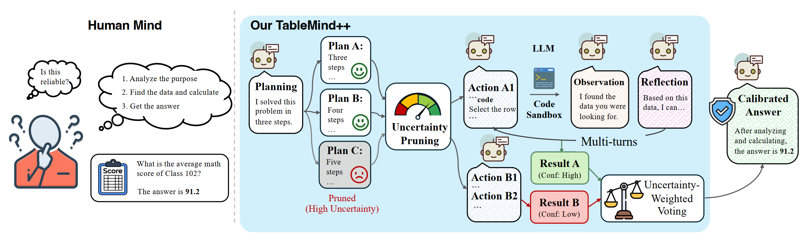
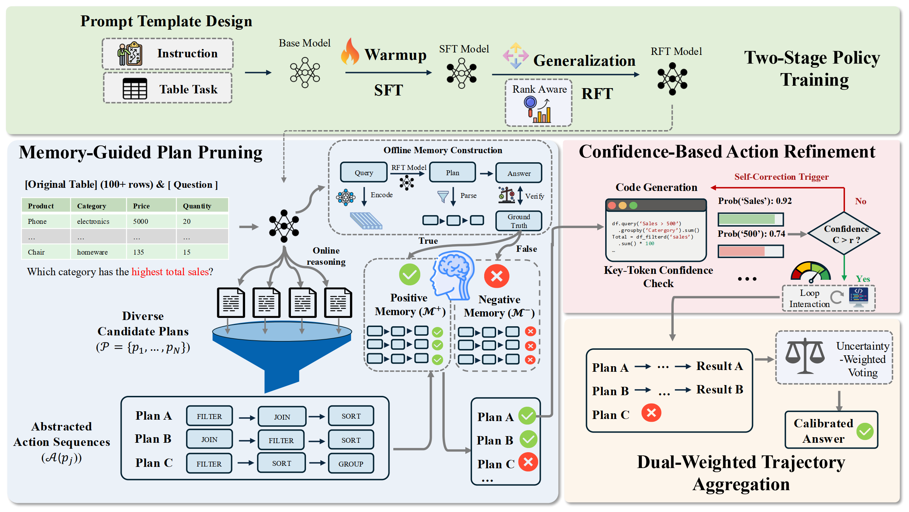

<div align="center">
<h1>
TableMind++: An Uncertainty-Aware Programmatic Agent for Tool-Augmented Table Reasoning
</h1>
</div>

<div align="center">
  <a href="https://huggingface.co/Jclennon/TableMind">
    🤗 <strong>Model (TableMind)</strong>
  </a> |
  <a href="https://huggingface.co/datasets/Jclennon/TableMind-data">
    📊 <strong>Train and Eval Dataset</strong>
  </a> |
  <a href="https://arxiv.org/abs/2509.06278">
    📖 <strong>TableMind Paper</strong>
  </a>
</div>

## 📖 Abstract

**TableMind++ extends the TableMind framework with an uncertainty-aware inference pipeline that mitigates hallucinations in multi-turn table reasoning. Building on two-stage training (SFT + RAPO), TableMind++ introduces three inference-time mechanisms: (1) Memory-Guided Plan Pruning to reduce epistemic uncertainty by validating plans against a dual-memory bank, (2) Confidence-Based Action Refinement to manage aleatoric uncertainty via token-level probability monitoring, and (3) Dual-Weighted Trajectory Aggregation to synthesise reliable consensus across multiple reasoning paths.**

## 🌟 Overview

<div align="center">

</div>

Large Language Models struggle with precise numerical operations on tables. TableMind++ addresses this through a **two-stage training strategy** followed by a **dynamic uncertainty-aware inference framework**:

1. **(Stage 1: SFT Warm-up)** Supervised fine-tuning on 200 high-quality distilled trajectories to bootstrap tool-use and plan-action-reflect capabilities.
2. **(Stage 2: RFT with RAPO)** Reinforcement Fine-Tuning with **Rank-Aware Policy Optimization (RAPO)**, a group-based policy gradient algorithm that identifies misaligned trajectories and amplifies learning signals through rank-aware advantage weighting.
3. **(Inference: Uncertainty-Aware Framework)** Three novel inference mechanisms:
   - **Memory-Guided Plan Pruning**: retrieves historical trajectories from a dual-memory bank (M⁺/M⁻) and filters plans based on contrastive structural similarity scores.
   - **Confidence-Based Action Refinement**: monitors token-level probabilities of semantic tokens (identifiers, literals) and triggers self-correction when confidence falls below threshold τ.
   - **Dual-Weighted Trajectory Aggregation**: weights each trajectory by `σ(S_con) × C(h_i)` and derives the final answer via weighted voting.

<p align="center"></p>

## ⚙️ Key Features

- **Autonomous Plan-Action-Reflect Agent**: Internalises deliberate multi-step reasoning within a lightweight Qwen3-8B backbone.
- **RAPO**: Rank-aware policy gradient that increases update weight for misaligned winner-loser trajectory pairs.
- **Multi-Perspective Reward Design**: R_format + R_acc + R_tool with curriculum decay `e^{-ρs}(β·I_success - C·N_turns²)`.
- **Dual-Memory Bank**: Offline self-generated trajectories split into M⁺ (correct) and M⁻ (deceptive) for structural plan validation.
- **Token-Level Confidence**: Lexical analysis identifies semantic tokens; geometric-mean log-probability avoids probability dilution.

## 🗂️ Repository Structure

```
TableMind-PP/
├── agent_r1/                    # Training framework (RAPO + multi-turn RL)
│   ├── llm_agent/               # LLM generation utilities
│   ├── src/                     # Core RL training code
│   │   ├── core_algos.py        # RAPO advantage computation
│   │   ├── agent_ray_trainer.py # Ray-based distributed trainer
│   │   ├── reward_score/        # Multi-perspective reward functions
│   │   │   ├── tqa.py           # R_format + R_acc + R_tool for QA tasks
│   │   │   └── tfv.py           # R_format + R_acc + R_tool for fact verification
│   │   └── config/
│   │       └── agent_trainer.yaml
│   ├── tool/                    # Tool execution environment
│   │   ├── tools/python_tool.py # Python sandbox (via SandboxFusion)
│   │   └── envs/nous.py         # NousToolEnv: tool call parsing & dispatch
│   └── vllm_infer/              # Basic single-pass inference
├── inference/                   # TableMind++ uncertainty-aware inference
│   ├── memory_builder.py        # SemanticParser + MemoryBank (M⁺/M⁻)
│   ├── plan_pruner.py           # Memory-guided plan pruning (Levenshtein)
│   ├── action_refiner.py        # Token-level confidence scoring & refinement
│   ├── trajectory_aggregator.py # Dual-weighted trajectory aggregation
│   └── tablemind_pp.py          # Main inference orchestrator
├── scripts/
│   ├── build_memory.py          # Offline dual-memory bank construction
│   └── evaluate.py              # Benchmark evaluation (WTQ/TabMWP/TabFact/HiTab/FinQA)
├── csv_files/                   # CSV data files for sandbox execution
├── environment.yml              # Conda environment (CUDA 12.4, PyTorch 2.6)
├── run_train.sh                 # Stage 2 RFT training entry point
└── run_inference.sh             # Full inference pipeline entry point
```

## 🚀 Quick Start

### Environment Setup

```bash
conda env create -f environment.yml
conda activate tableMind-pp
```

#### Sandbox Fusion (required for code execution)

Follow the official guide: [SandboxFusion](https://github.com/bytedance/SandboxFusion)

```bash
# Run SandboxFusion in a tmux session (default: http://localhost:8080)
tmux new-session -d -s sandbox "sandbox-fusion serve --port 8080"
```

## 🛠️ Training

### Stage 1: SFT Warm-up

Fine-tune on 200 distilled synthetic trajectories for 1 epoch with lr=1e-6. Use any standard SFT framework (e.g. HuggingFace Trainer, LLaMA-Factory) on the SFT dataset.

### Stage 2: Reinforcement Fine-Tuning (RAPO)

```bash
# Edit run_train.sh to set BASE_MODEL, PROJECT_NAME, EXPERIMENT_NAME, CSV_FILE_PATH
bash run_train.sh
```

Key hyperparameters (matching the paper):

| Parameter | Value |
|-----------|-------|
| Backbone | Qwen3-8B |
| Learning rate | 1e-6 |
| Group size G | 8 |
| Max turns | 3 |
| Temperature | 1.0 |
| R_tool: ρ | 0.05 |
| R_tool: β | 0.5 |
| R_tool: C | 0.01 |
| RAPO: ε_low | 0.2 |
| RAPO: ε_high | 0.28 |
| GPUs | 4× A800 |

## 🔍 Inference

The full TableMind++ inference pipeline runs in **two steps** after training:

### Step 1: Build the Dual-Memory Bank (offline, once)

```bash
# Start vLLM server with the trained model
python -m vllm.entrypoints.openai.api_server \
    --model /path/to/trained/tablemind \
    --served-model-name tablemind \
    --port 8000

# Build memory bank from training data
python scripts/build_memory.py \
    --model-path tablemind \
    --train-data data/train.parquet \
    --output memory_bank.pkl \
    --encoder BAAI/bge-m3
```

### Step 2: Run TableMind++ Evaluation

```bash
# Edit run_inference.sh to set MODEL_PATH, DATASET, etc.
bash run_inference.sh

# Or run evaluation directly:
python scripts/evaluate.py \
    --data-path data/test.parquet \
    --memory-bank memory_bank.pkl \
    --dataset WTQ \
    --num-candidates 16 \
    --top-k-memory 5 \
    --retention-ratio 0.5 \
    --confidence-threshold 0.8
```

Key inference hyperparameters (paper defaults from Table 6):

| Parameter | Value | Description |
|-----------|-------|-------------|
| N | 16 | Candidate plans sampled |
| K | 5 | Memory prototypes retrieved |
| ρ | 0.5 | Plan pruning retention ratio |
| τ | 0.8 | Confidence threshold for action refinement |

## 📊 Main Results

| Model | WikiTQ | TabMWP | TabFact | HiTab | FinQA |
|-------|--------|--------|---------|-------|-------|
| GPT-5 | 77.42 | 96.12 | 90.05 | 44.52 | 28.93 |
| Deepseek-R1 | 74.63 | 98.03 | 86.25 | 76.08 | 37.42 |
| Table-R1 | 74.86 | 96.02 | 87.17 | 64.76 | 41.27 |
| TableMind | 76.82 | 99.27 | 91.85 | 71.95 | 42.02 |
| **TableMind++** | **78.07** | **99.57** | **93.73** | **73.69** | **45.48** |

## 📐 Method Details

### RAPO Algorithm

RAPO builds on GRPO with three enhancements:
1. **No KL penalty**: removes reference policy constraint for larger exploration.
2. **Token-level normalisation**: normalises by sequence length to prevent length bias.
3. **Asymmetric clipping**: `ε_low=0.2, ε_high=0.28` promotes generation diversity.

The rank-aware advantage weight γ_w,l is increased for misaligned pairs where the model assigns higher confidence to a lower-reward trajectory:

```
γ_w,l = 1 + α · I[log P(o_w) < log P(o_l)]
A'_i  = γ_i · (R_i - mean(R)) / std(R)
```

### Memory-Guided Plan Pruning

1. Parse plans into action sequences using keyword-to-primitive mapping (FILTER, GROUP, AGGREGATE, SORT, JOIN, COMPUTE, SELECT, MERGE, PIVOT, RENAME).
2. Retrieve top-K similar historical instances via cosine similarity on bge-m3 embeddings.
3. Compute contrastive score: `S_con(p_i) = D⁻(p_i) - D⁺(p_i)` using Levenshtein edit distance.
4. Retain top ρ=50% of candidates.

### Confidence-Based Action Refinement

Compute `C(a) = exp(mean_{i ∈ K} log P(a_i))` over semantically significant tokens only (identifiers, function names, numeric/string literals), excluding boilerplate Python syntax. If `C(a) < τ`, trigger a self-correction prompt before sandbox execution.

### Dual-Weighted Trajectory Aggregation

```
w_i = σ(S_con(p_i)) · C(h_i)
ŷ   = argmax_{y} Σ_i I(y_i = y) · w_i
```

## 📄 Citation

```bibtex
@article{cheng2025tablemindpp,
  title={TableMind++: An Uncertainty-Aware Programmatic Agent for Tool-Augmented Table Reasoning},
  author={Cheng, Mingyue and Yu, Shuo and Jiang, Chuang and Tao, Xiaoyu and Mao, Qingyang and Ouyang, Jie and Liu, Qi and Chen, Enhong},
  journal={arXiv},
  year={2025}
}
```
